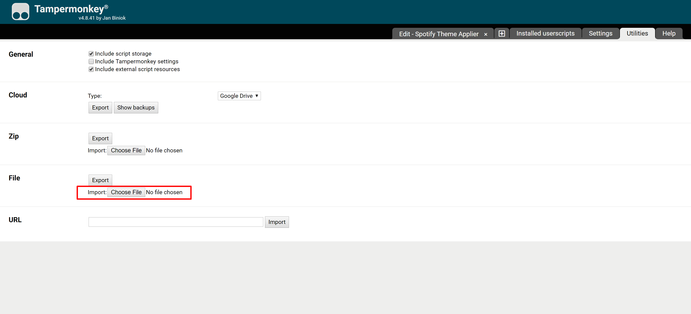
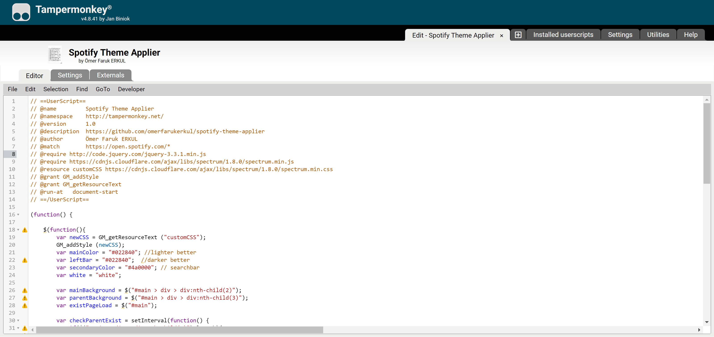
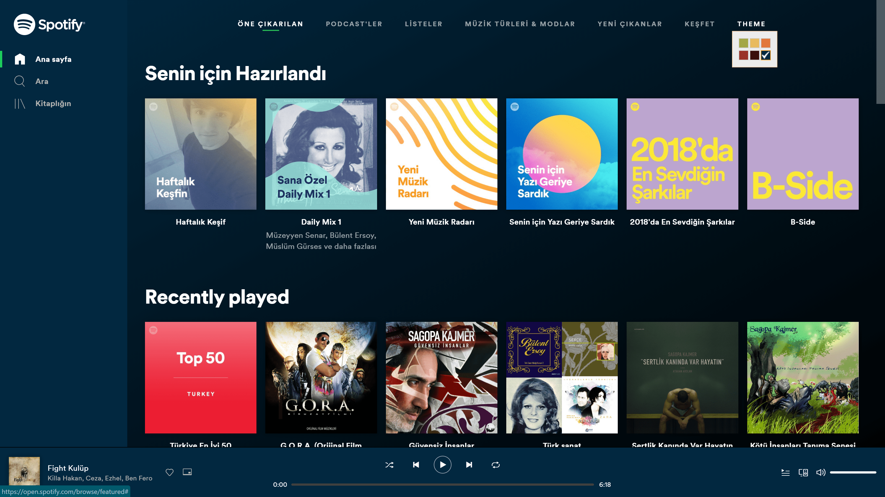

# spotify-theme-applier
## Apply themes on open spotify via tampermonkey

### `Copy inside of the spotify-theme-applier.txt into a new tampermonkey script or simply import the txt file. Enjoy`

| | | |
|:-------------------------:|:-------------------------:|:-------------------------:|
|  |  ||
|  |  ||

| | | |
|:-------------------------:|:-------------------------:|:-------------------------:|
|||

